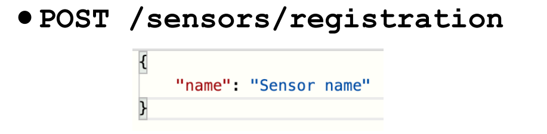
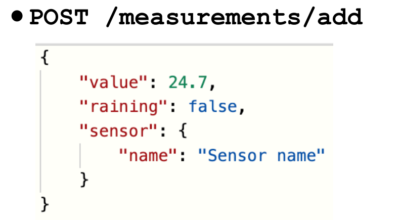
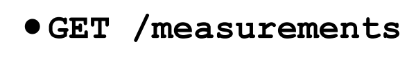
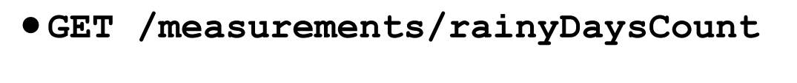

# RestApiApp
The RestApiApp is my first app that somehow use two modern architecture features : REST + Microservices. 

<a id="readme-top"></a>


<!-- PROJECT LOGO -->
<br />
<div align="center">
  <a href="https://github.com/Saintghetto17/RestApiApp/blob/main/readme_images/rest-api.png">
    
  </a>


<!-- ABOUT THE PROJECT -->
## About The Project


This project is my first step for understanding RestApi applications. Earlier, I used to touch web practicing my Spring skills. However, as I want to start backend development, it is really important
to understand the principles of 'as I say' Inter-Service JSON communication.  

Things that I have already done:
* Weather microservices that simply adds information about the temprature from any Sensor
* Dummy Client that sends not parallel requests to the server

Things that I want to make and that are not done yet:
* Parallel Client that sends request in many threads
* Machine Learning Model Service that analyze temperature on sensor and gives some recommendations on decreasing the temperature
* Integration with some kind of Public Weather/temperature services by its API (f.e Yandex Weather) 
* Make the app more clever : asyncronyous task handling, use indexes in database, add some message brocker (f.e Kafka).
  
Of course, my project now not touch enough, but it is the step for a good one.

Use the `BLANK_README.md` to get started.

<p align="right">(<a href="#readme-top">back to top</a>)</p>


### Built With

This section should list any major frameworks/libraries used to bootstrap your project. Leave any add-ons/plugins for the acknowledgements section. Here are a few examples.

* [![Maven][Apache-Maven]][Maven-url]

<p align="right">(<a href="#readme-top">back to top</a>)</p>


<!-- GETTING STARTED -->
## Getting Started

This project uses docker-compose for deploying a project. In the future, I will remove this configs, because app will be deployed on server and users should not do it by themselves.
Anyway, this project will stay open-source.


### Prerequisites

* java
  ```sh
  sudo apt install openjdk-17-jdk openjdk-17-jre
  ```
* maven
  ```sh
  sudo apt install maven -y
  ```

### Installation and Deploy

NOTE : This section will be updated after I add communication with another API

1. Clone the repo
   ```sh
   git clone https://github.com/Saintghetto17/RestApiApp.git
   ```
2. Get all dependencies with maven
   ```sh
   mvn dependency:resolve -U
   ```
3. Deploy PostgreSQL and PgAdmin4
  ```sh
   docker-compose up -d
   ```

4. Get into weather-microservice folder
   ```sh
   cd weatherservice
   ```

5. Make jar file of the project
   ```sh
   ./mvnw package
   ```
6. Create docker image
   ```sh
   docker build -t your_name/weather_service:v1 .
   ```
7. Deploy weather-service
  ```sh
   docker compose up -d
   ```
8. Do the same steps for client-service

<p align="right">(<a href="#readme-top">back to top</a>)</p>


<!-- USAGE EXAMPLES -->
## Usage

After your installation and deployment, you have two ways :
1. Use client-service to check the work of weather-service.
2. Send http-requests with POSTMAN or other interfaces:
  <div align="center">
  <a href="https://github.com/Saintghetto17/RestApiApp/blob/main/readme_images/post-register.png">
    
  </a>
    
  <br/>
  
  <div align="center">
  <a href="https://github.com/Saintghetto17/RestApiApp/blob/main/readme_images/post_add_measure.png">
    
  </a>
    
  <br/>
  
  <div align="center">
  <a href="https://github.com/Saintghetto17/RestApiApp/blob/main/readme_images/get_all.png">
    
  </a>
    
  <br/>
  
  <div align="center">
  <a href="https://github.com/Saintghetto17/RestApiApp/blob/main/readme_images/get_rainy.png">
      
  </a>
    
<p align="right">(<a href="#readme-top">back to top</a>)</p>


<!-- CONTACT -->
## Contact

Telegram - [@SaintPher](https://t.me/SaintPher) - Ilya.Novitskiy.04@mail.ru

Project Link: [https://github.com/Saintghetto17/RestApiApp](https://github.com/Saintghetto17/RestApiApp)

<p align="right">(<a href="#readme-top">back to top</a>)</p>


<!-- MARKDOWN LINKS & IMAGES -->
<!-- https://www.markdownguide.org/basic-syntax/#reference-style-links -->
[Maven-url]: https://maven.apache.org/
[Apache-Maven]: https://img.shields.io/badge/Apache-Maven
